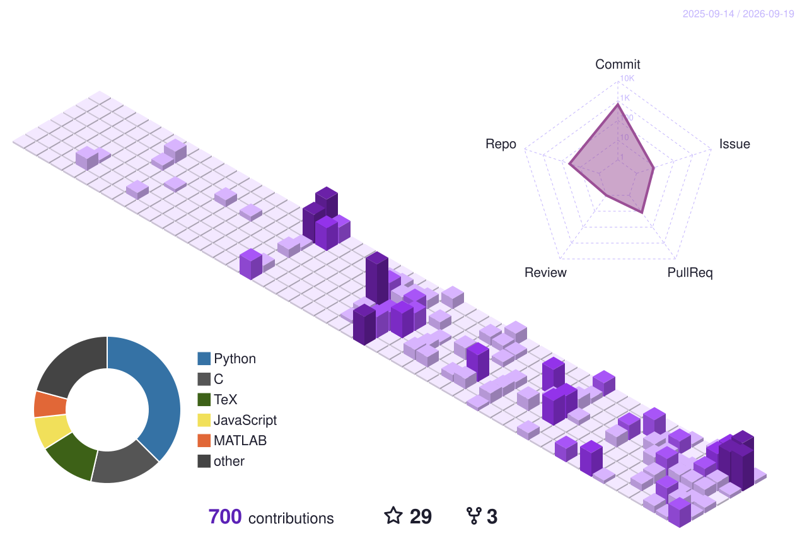

# Choose Life

Wow, u foung this lil corner, cool!  (*´∀`*)   

  

---

[![FURRY](https://img.shields.io/badge/FURRY-9B4F96?style=for-the-badge&logo=data%3Aimage/svg%2Bxml%3Bbase64%2CPHN2ZyB4bWxucz0iaHR0cDovL3d3dy53My5vcmcvMjAwMC9zdmciIHZpZXdCb3g9IjAgMCAyNCAyNCI%2BPHBhdGggZmlsbD0iI0Q2MDI3MCIgZD0iTTYuMjUgNS4yNUM2LjI1IDMuODI4NDIgNy4yNzgzNSAyLjUgOC43NSAyLjVDMTAuMjIxNyAyLjUgMTEuMjUgMy44Mjg0MiAxMS4yNSA1LjI1QzExLjI1IDYuNjcxNTggMTAuMjIxNyA4IDguNzUgOEM3LjI3ODM1IDggNi4yNSA2LjY3MTU4IDYuMjUgNS4yNVoiLz48cGF0aCBmaWxsPSIjRDYwMjcwIiBkPSJNMSA4Ljc1QzEgNy4zMjg0MiAyLjAyODM1IDYgMy41IDZDNC45NzE2NSA2IDYgNy4zMjg0MiA2IDguNzVDNiAxMC4xNzE2IDQuOTcxNjUgMTEuNSAzLjUgMTEuNUMyLjAyODM1IDExLjUgMSAxMC4xNzE2IDEgOC43NVoiLz48cGF0aCBmaWxsPSIjRDYwMjcwIiBkPSJNMTIgMTBDOC4xMzQwMSAxMCA1IDEzLjEzNCA1IDE3QzUgMTguMzYwOCA1LjcyMDcxIDE5LjM4NzYgNi43MDA2NSAyMC4wNDQxQzcuNjYzMjMgMjAuNjg5IDguODk3NjQgMjEgMTAuMDc4MiAyMUgxMy45MjE4QzE1LjEwMjQgMjEgMTYuMzM2OCAyMC42ODkgMTcuMjk5NCAyMC4wNDQxQzE4LjI3OTMgMTkuMzg3NiAxOSAxOC4zNjA4IDE5IDE3QzE5IDEzLjEzNCAxNS44NjYgMTAgMTIgMTBaIi8%2BPHBhdGggZmlsbD0iI0Q2MDI3MCIgZD0iTTEyLjc1IDUuMjVDMTIuNzUgMy44Mjg0MiAxMy43NzgzIDIuNSAxNS4yNSAyLjVDMTYuNzIxNyAyLjUgMTcuNzUgMy44Mjg0MiAxNy43NSA1LjI1QzE3Ljc1IDYuNjcxNTggMTYuNzIxNyA4IDE1LjI1IDhDMTMuNzc4MyA4IDEyLjc1IDYuNjcxNTggMTIuNzUgNS4yNVoiLz48cGF0aCBmaWxsPSIjRDYwMjcwIiBkPSJNMTggOC43NUMxOCA3LjMyODQyIDE5LjAyODMgNiAyMC41IDZDMjEuOTcxNyA2IDIzIDcuMzI4NDIgMjMgOC43NUMyMyAxMC4xNzE2IDIxLjk3MTcgMTEuNSAyMC41IDExLjVDMTkuMDI4MyAxMS41IDE4IDEwLjE3MTYgMTggOC43NVoiLz48L3N2Zz4%3D&logoColor=white&labelColor=0038A8&label=%20)](https://en.wikipedia.org/wiki/Furry_fandom)

---

Hi it's *Basstt ElSevic* here, also call me "阿酒" or 'Alkhol' ~~(yes! without o!)~~  please ₍ ᐢ.ˬ.ᐢ ₎ ♡~ .

  

As u can see ₍ ^. .^ ₎⟆, I like:

  

also as a lazy one, I really do hope I can insist on something, or even better, obessed on something ꒰ঌ ( ˶ˆᗜˆ˵ ) ໒꒱

  

  

## Choose something else

  

  

## Choose for what

可为什么要“选择生活，选择点别的”？

Then why “choose life, choose something else”?

这是一个好问题。

That is a good question.

当人能成为那一份体面的存在的时候，大家似乎愿意付出代价。于是，我们纷纷穿上了那些挽具。接着，去相信，这是我的选择。成为那体面的存在。去学会读空气，能在别人还保持沉默的情况下，读懂现在到底是咋回事，并作出现在最正确的选择；去懂，如何表现得得体，去规范自己的行为，不给大家添麻烦；去有一份和大家一样的价值观，当大家都表现得即使愚蠢时，但正因为大家都做，所以这是体面的，你也模仿着；去合群，去和那些人成为朋友，懂得那些无聊的内部才懂的黑话；去找一个对象，即使找不到，也要装作你很渴望的样子；去听流行乐，去懂最新的梗，去永远都不错过每个话题，并和周围的人谈论，接着，开始演化，成为那体面之人，维持你那体面的生活与符号。那些朋友？反正那本来也是为了体面而联系上的，但从来都不是，何有抛弃一说。和那些，更体面的人在一起，谈论那些新潮，那些时髦，向前，向前。

When a person can become that respectable thing, everyone seems willing to pay the price. So we all put on those harnesses. Then, to believe: this is my choice. To become that respectable thing. To learn to read the room, to understand, while everyone else stays silent, what is really going on, and to make the most correct choice of the moment; to know how to behave properly, to discipline your own conduct, not to cause anyone any trouble; to hold the very same values as everyone, and when everyone is behaving even stupidly, precisely because everyone does it, so this is respectable, and you imitate too; to fit in, to become friends with those people, to know those boring insider-only slang; to find a partner, and even if you cannot find one, to pretend you long for it; to listen to pop songs, to know the newest memes, to never miss any topic, and to talk about it with everyone around you, and then, to begin to evolve, to become that respectable person, to keep up your respectable life and its symbols. Those friends? Anyway, they were only connected for the sake of respectability in the first place, but that was never so, so how is there any talk of letting go? To be with those even more respectable people, to talk about the new, the fashionable, onward, onward.

“你占有的东西，最终会占有你。”——《搏击俱乐部》

“The things you own end up owning you.”——Fight Club

于是，经过演化，时间的恩赐，自然的伟力！体面的人与野兽，就区分出了彼此。

Thus, through evolution, the gift of time, the great force of nature! The respectable ones and the beasts were set apart from each other.

野兽便被那些体面的存在所鄙视着，但，为了体面，明面上，还是不能做出那些，有损自我体面的行为。保持笑容。

The beast is despised by those respectable beings, but, for the sake of respectability, on the surface, it still cannot do those things that would damage its own respectability. Keep smiling.

去，展示自己体面的崇高感，多么的宽容！居然接受了野兽在身边，接着，既然你们早已区分了彼此，以及本来也即使对体面同类都使用这一套，更何况一只野兽？

Go, display the sublime feel of your respectability, how magnanimous! To take a beast at your side after all, then, since you had long drawn the line between yourselves, and since this is the routine you use even on your respectable kin, how much more so for a mere beast?

拿出了挽具。

The harness was brought out.

野兽便被那些体面的存在所鄙视着，即使，按世俗的评价被视为愚钝，野兽也幻想着，只要我套进去，我就能像他们一样，成为更高的存在，享受那些，荣誉，荣光，在彼此“精致”的目光里互相吹牛

The beast is despised by those respectable beings; even if deemed dull by worldly judgment, the beast still fantasizes: just strap in, and I could be like them, become a higher existence, enjoy that glory, that radiance, boasting to each other in glances of mutual “refinement”.

努努力，还是能套进去的。

Work a little harder, and it can still be strapped in.

“选择……”

“Choose…”

但是，你的爪子和尾巴还是会划伤体面者的皮肤，这可不行啊，有些野兽的同类，立刻忍受着痛苦，拔掉了爪子。砍断尾巴。

But your claws and tail still graze the skin of the respectable, and that will not do; some of the beast’s own kind, at once enduring the pain, tore out their claws. Cut off their tails.

在很早很早之前野兽们便吞下了苹果。当演化还没开始的时候，那果实成为了他们身体的一部分。但那时，彼此的区分还不是很大。

Long, long ago the beasts ate the apple. Before evolution had even begun, that fruit had already become part of their bodies. But back then, the difference between them was not yet so great.

幻想便开始了，即使被强行套上挽具，毛发失去了往日的润泽。

The fantasy began — even strapped forcibly into the harness, the fur lost its former luster.

到了约的日子，当索要承诺之时，体面的人表达了对野兽的厌恶。

When the day of the tryst arrived, when a promise was asked of you, the respectable ones voiced their disgust for the beast.

毕竟，是你弄脏了他们的衣服；是你读不懂空气，能从空气中用你的鼻子闻到体面人所无法欣赏的美妙气息，但你却读不懂那尖酸刻薄的酸涩；是你的动作弄到了他们，即使你戴着挽具，可你的生命力依然旺盛，如同火焰一样；是你让他们的体面氛围弄脏、毁掉，他们那些应让旁人羡慕的、仰慕的展示，你看不懂，因为你觉得街角的野花更美；是你让他们感到怪异，你的爱好、你的那旧的圈子、朋友，让他们感到不舒服。

After all, it was you who soiled their clothes; it was you who could not read the room, yet could smell, out of the air with your nose, that beautiful scent the respectable cannot appreciate, and you could not read that sharp, caustic sourness; it was your movements that touched them wrong — even wearing the harness, your life-force still burns, like a flame; it was you who dirtied and ruined their respectable atmosphere, those displays they wished others to envy and admire, and you could not see it, because you found the wildflowers at the street corner more beautiful; it was you who made them feel strange — your hobbies, your old circle, your friends all made them uncomfortable.

“选择……”

“Choose…”

曾幻想着，当佩戴上挽具，模仿他们的样子，能成为同类？

Once fantasized: with the harness on, imitating them, could I become one of them?

当甩着尾巴，从他们的视角里消失之后，那厌恶的气息，便随风飘出。有时，风尝试警告野兽，告知真相，用鼻子仔细嗅了嗅，惊讶。因为在他们面前时，他们似乎，很“礼貌。”

Having wagged its tail and vanished from their sight, that stench of disgust drifted out upon the wind. Sometimes the wind tries to warn the beast, to tell it the truth; it sniffed carefully, astonished. Because, in front of them, they seemed, very “polite.”

“因为人的感情是很难控制的，所以我们一直保持距离。”——《堕落天使》

“Because human emotions are hard to control, so we always kept our distance.”——Fallen Angels

“我想选择生活……”

“I want to choose life…”

可现在情况的确是这个样子，即使套上了你的挽具，即使将自己的爪子消掉，他们告诉你，那是，你的错，的确，是你的那些行为，破坏了他们的体面啊。

But now this is how it truly is — even with your harness on, even after cutting away your own claws, they tell you it was your fault, truly, it was those actions of yours that ruined their respectability.

开始哭泣，尝试带得更紧，尝试低着头，约束自己的行为，但这是没有用的。

It begins to cry. Tries to strap it tighter, tries to bow its head, to restrain its own behavior — but it is no use.

因为自然的伟力，物种的分化早已完成。

Because the great force of nature, the divergence of species, was already complete long ago.

他们不喜欢你，因为你吞下了那果实。

They do not like you, because you swallowed that fruit.

他们不喜欢你，因为你曾经走着那条他们没勇气走的路。

They do not like you, because you once walked the road they had no courage to walk.

他们不喜欢你。

They do not like you.

你是野兽

You are the beast

“我是上帝孤独的人。”——《出租车司机》

“I’m God’s lonely man.”——Taxi Driver

可你是高贵的野兽，你有着利爪，你有着獠牙，你有着耳朵，你有着鼻子，你有着漂亮的尾巴，当生命的火花燃烧时，那是多么的有力。当你低下头颅，让街头的小花，那些体面人不屑去闻的，香气是多么的美妙。风灌入你的鬃毛，抚摸着你的身体，你内心的灵魂，是多么的快乐。

But you are the noble beast; you have sharp claws, you have fangs, you have ears, you have a nose, you have a beautiful tail. When the spark of life burns, how powerful it is. When you lower your head, to let the little flowers at the street corner — those the respectable deign not to smell — how wonderful the scent is. The wind pours through your mane, strokes your body, and the soul inside you, how joyful it is.

“我见过你们无法想像的东西，所有的这些时刻，都会消失在时间里，像雨中的泪。”——《银翼杀手》

“I’ve seen things you wouldn’t believe — all those moments will be lost in time, like tears in rain.”——Blade Runner

就因为你是那阴影，他们便厌恶着你

Just because you are that shadow, they loathe you

就因为你是那他们不敢梦想的，他们便厌恶着你

Just because you are that which they dare not dream of, they loathe you

就因为……

Just because…

就因为……

Just because…

体面的人，辱骂，你是怪物，因为你那漂亮的大爪子。因为，你找到了一个方式，一个很简单，但是他们绝对不会去选择的方式，他们便产生了存在性危机。自己费力，勾心斗角的安排，努力维持的体面日常，都是笑话。自己被称为“正常”，那种“人类感”都是笑话。

The respectable revile you: you are a monster, because of those beautiful big claws of yours. Because you found a way — a very simple way, but one they would absolutely never choose — they have an existential crisis. All their toiling, their scheming arrangements, the respectable life they worked so hard to keep up — it is all a joke. The way they call themselves “normal,” that “human feeling” — it is all a joke.

“你只看到你想看到的我们——用最简单的方式，最方便的定义。”——《早餐俱乐部》

“You see us as you want to see us — in the simplest terms, the most convenient definitions.”——The Breakfast Club

他们便说，你不是“人类”，你不“正常”，便用道德，他们的体面道德，审判着。

Then they say, you are not “human,” you are not “normal,” and with morality — their respectable morality — they judge you.

“比人更有人性。”——《银翼杀手》

“More human than human.”——Blade Runner

他们害怕另一种方式。

They fear another way.

“选择生活，选择点别的。”

“Choose life, choose something else.”

彼岸的苦痛再如何可怕，不过是幻想与虚构，此岸的悲剧却是现在进行时。

However terrible the pain on the far shore, it is nothing but fantasy and fiction; the tragedy on this shore is in the present tense.

“人们以为那全是痛苦与绝望……但他们忘了，那其中的快乐。”——《猜火车》

“People think it’s all misery and desperation… but they forget the pleasure of it.”——Trainspotting

“我要做你做不到的事。”——《蓝色青春》

“I’ll do something you can’t do.”——Blue Spring

脱下那挽具，放逐自己，因为体面者其实不配放逐野兽，你是自己的放逐者。放逐自己，放逐到那片温柔的原野。

Take off that harness, banish yourself, because the respectable are not worthy of banishing the beast — you are your own exile. Banish yourself, banish yourself to that gentle wild.

感受着，那草地的柔软，品味着，风的温柔。

Feel the softness of that grassland, savor the gentleness of the wind.

“失去一切之后，你才真正自由。”——《搏击俱乐部》

“It’s only after we’ve lost everything that we’re free to do anything.”——Fight Club

---

  

  

  

  

  

  

  

  

  

